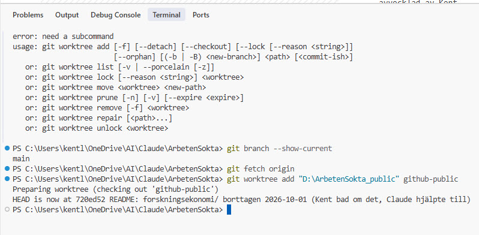
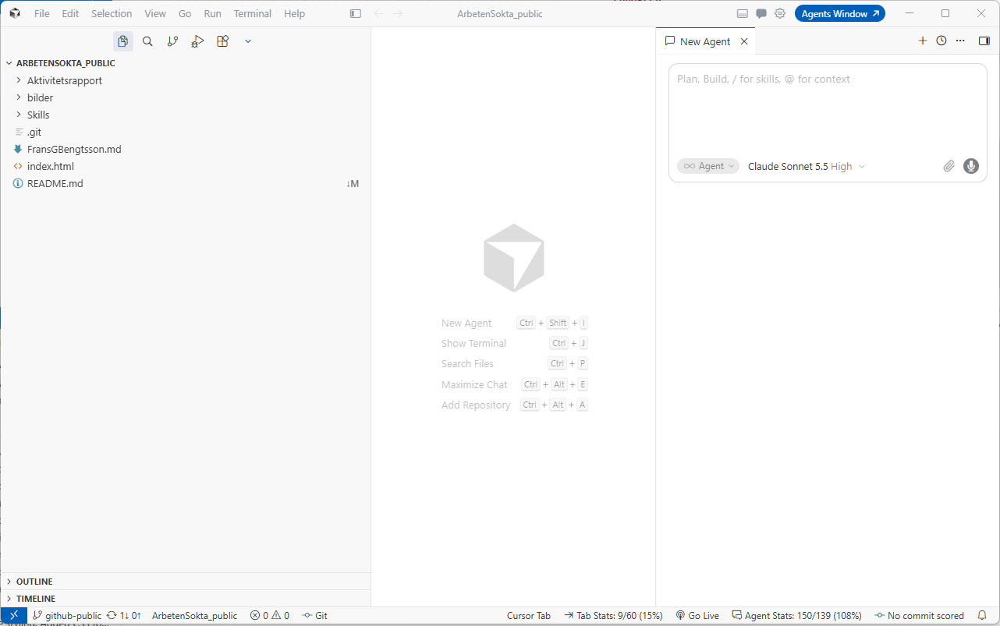

# Hantera de publika sidorna i ArbetenSokta – steg för steg

Den här sidan beskriver hur de publika filerna i det här repot hanteras på ett
sätt som inte förstör något i det privata projektet. Den skrevs 2026-10-01 av
Kent Lundgren tillsammans med Claude (Anthropics AI-assistent), medan de
faktiskt gjorde stegen: först togs en gammal publik sida bort, sedan skapades en
andra arbetsmapp med `git worktree`, och sedan skrevs den här guiden.

Se även [README](README.md) (översikt) och
[`Skills/humanizer/skillprocess.md`](Skills/humanizer/skillprocess.md)
(bakgrunden till hur de publika filerna kom att ligga på en egen gren).

## 1. Idén i en bild

Det privata projektet och den publika delen bor i **samma repo**, men på olika
grenar:

| Gren (lokalt) | Fjärrgren på GitHub | Innehåll | Syns på nätet? |
|---|---|---|---|
| `main` | finns inte på GitHub | allt: ansökningar, CV, loggar, PRD | **Nej, aldrig** |
| `github-public` | `public` | bara de filer som medvetet valts ut | Ja |

Namnen skiljer sig medvetet (`github-public` lokalt, `public` på GitHub), så
pushen skrivs alltid `git push origin github-public:public`.

## 2. Problemet med `git checkout`, och lösningen

Om man byter gren i projektmappen (`git checkout github-public`) tar git bort
alla privata filer från disken och skapar dem på nytt när man går tillbaka.
OneDrive och Utforskaren tolkar det som nya filer och sätter alla datum till
dagens datum.

**Lösningen är en andra arbetsmapp, `git worktree`.** Samma `.git`, två mappar:

| Mapp | Gren | Används till |
|---|---|---|
| `C:\Users\kentl\OneDrive\AI\Claude\ArbetenSokta` | `main` | allt privat arbete. Står kvar på `main` och rörs aldrig av publicering. |
| `D:\ArbetenSokta_public` | `github-public` | allt som ska bli publikt. Egen mapp, utanför OneDrive. |

### Skapa den andra mappen (görs en gång)

I terminalen, i huvudmappen, medan du står på `main`:

```powershell
git branch --show-current        # ska svara: main
git fetch origin                 # hämta senaste från GitHub
git worktree add "D:\ArbetenSokta_public" github-public
```



Öppna sedan `D:\ArbetenSokta_public` i ett eget Cursor-fönster. Där syns bara
de publika filerna, och statusraden visar grenen `github-public`:



Kontrollera: `git worktree list` visar de två mapparna och vilken gren var och
en står på.

## 3. Lägga till en ny publik sida

1. **Skriv filen i `D:\ArbetenSokta_public`**, inte i huvudmappen. En
   `.md`-fil visas direkt som läsbar sida på GitHub, en `.html`-fil kan visas
   som Live Page via GitHub Pages.
2. **Lägg filen på vitlistan.** Pre-push-hooken släpper bara igenom filer som
   står i `ALLOWED_FILES`. Lägg en rad per fil i *båda* kopiorna:
   `.git/hooks/pre-push` (den aktiva) och `.githooks/pre-push` (referenskopian i
   huvudmappen). Gör det **före** pushen, annars blockeras den.
3. **Kontrollera innehållet** (se avsnitt 6): inga personuppgifter, inga
   kontaktpersoner, inget från `Intervju/`.
4. **Committa och pusha från den andra mappen:**

   ```powershell
   git status
   git add <filen>
   git commit -m "<vad och varför>"
   git push origin github-public:public
   ```
5. **Titta efteråt:** filen syns på
   [github.com/kentlundgren/ArbetenSokta/tree/public](https://github.com/kentlundgren/ArbetenSokta/tree/public).
   GitHub Pages bygger om grenen `public` på någon minut
   ([kentlundgren.github.io/ArbetenSokta](https://kentlundgren.github.io/ArbetenSokta/)).

## 4. Hämta ändringar som gjorts direkt på GitHub

Ibland ändras `public` på GitHub (t.ex. via webben eller API:et). Då ligger den
lokala grenen "bakom". Kör i den andra mappen:

```powershell
git pull --ff-only
```

Det ändrar bara de filer som faktiskt ändrats, och huvudmappen påverkas inte.

## 5. Ta bort en publik sida

Exempelvis togs `forskningsekonomi/` bort 2026-10-01. I den andra mappen:

```powershell
git rm -r <mapp-eller-fil>
git commit -m "Ta bort <sidan>"
git push origin github-public:public
```

Sidan försvinner från GitHub Pages inom några minuter. **Observera:** filerna
finns kvar i repots tidigare historik. Vill man att något verkligen ska bort från
nätet krävs mer än att ta bort filen (gör repot privat eller skriv om historiken).
Ta också bort filens rad ur vitlistan i hookarna.

Att ta bort sidan från den lokala `main`-kopian är en separat sak. Den påverkas
inte.

## 6. Skydden, och vad som aldrig ska bli publikt

- **Pre-push-hook** (`.git/hooks/pre-push`): tillåter bara push av
  `github-public`, och bara filer på vitlistan. Hooken ligger i den gemensamma
  `.git`-mappen som båda arbetsmapparna använder. Den gäller dock bara den klon
  där den är installerad.
- **GitHub branch-ruleset:** ingen annan gren än `public` kan skapas eller
  uppdateras på GitHub. Det gäller även från en klon utan hook.
- **Aldrig publikt:** `main`, allt under `Intervju/`, ansökningar, CV, loggar
  över sökta jobb och intervjuer, kontaktpersoner och personlighetstester.
  Aktivitetsloggen och rapporterna till Arbetsförmedlingen stannar privata.
- **Commit och push:** Kent committar och pushar själv i Cursor. Claude
  committar bara när Kent uttryckligen ber om det, och pushar aldrig `main`.

## 7. Felsökning

| Meddelande | Betyder | Gör så här |
|---|---|---|
| `fatal: 'github-public' is already used by worktree at ...` | Grenen är redan utcheckad i den andra mappen. | Det är ett skydd. Arbeta i den andra mappen i stället. |
| `behind 1` / `non-fast-forward` | `public` på GitHub har nyare commits. | `git pull --ff-only` i den andra mappen, pusha sedan. |
| `SPÄRR: ... blockerad` från hooken | En fil saknas på vitlistan, eller fel gren pushas. | Lägg filen i `ALLOWED_FILES`, pusha `github-public:public`. |
| Fildatum blev dagens datum i huvudmappen | Någon gjorde `git checkout` mellan grenarna där. | Gå tillbaka till `main` och återställ datumen från git-historiken. Använd framöver den andra mappen. |

## 8. Städa bort den andra mappen

När den inte behövs längre (tar bara bort mappen, inte grenen eller något på
GitHub):

```powershell
git worktree remove "D:\ArbetenSokta_public"
```
