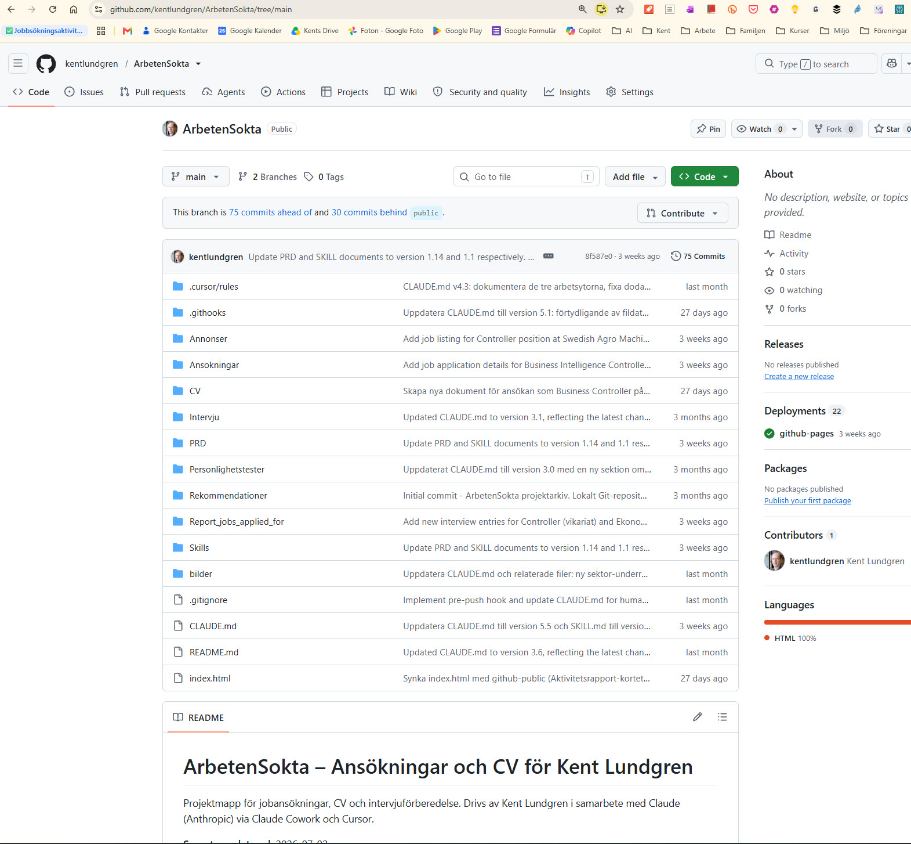
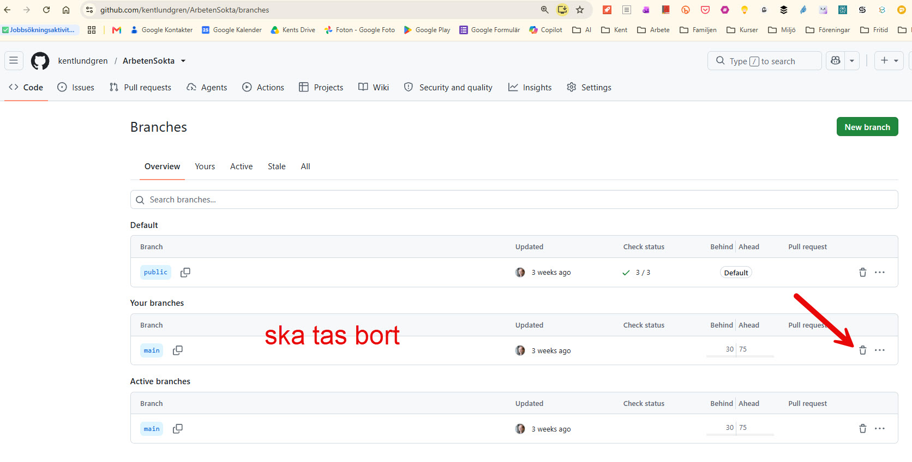
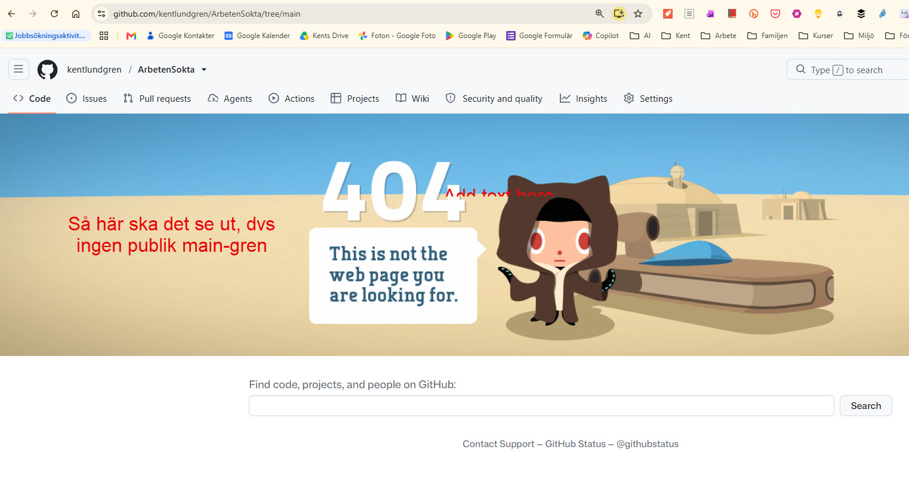

# ArbetenSokta

Det här publika repot innehåller enstaka, medvetet utvalda filer ur ett annars
privat projekt (jobbansökningar, CV, personlighetstester). Namnet `ArbetenSokta`
är ett arv från det ursprungsprojektet. De allra flesta filerna där ska aldrig
bli publika, och kan tekniskt inte pushas hit, bara de filer som explicit valts
ut hamnar här. Just nu är det två: en Claude Skill som tar bort tecken på
AI-genererad text ("humanizer"), och en sida med en delmängd av sökta jobb
redovisade till Arbetsförmedlingen. Fler kan läggas till, se
["Lägga till fler publika filer"](#lägga-till-fler-publika-filer) nedan.

I augusti 2026 gick det ändå fel en gång: den privata `main`-grenen råkade
hamna publikt på GitHub i ~19 dagar. Vad som hände, varför spärrarna inte
fångade det, och hur det rättades finns dokumenterat längst ned – se
["När den privata main-grenen låg publikt"](#när-den-privata-main-grenen-låg-publikt-aug-2026).

## Live-sida

**[kentlundgren.github.io/ArbetenSokta](https://kentlundgren.github.io/ArbetenSokta/)**
– samma innehåll som denna README, men som en fristående GitHub Pages-sida.

## Innehåll

- [`Skills/humanizer/SKILL.md`](Skills/humanizer/SKILL.md) – själva skillet:
  regler för att ta bort AI-skrivmönster ur en text, baserat på Wikipedias
  ["Signs of AI writing"](https://en.wikipedia.org/wiki/Wikipedia:Signs_of_AI_writing).
  Hur du använder det från vilket verktyg/repo som helst, med färdiga promtar:
  ["Använda humanizer-skillet på vilken text som helst"](#använda-humanizer-skillet-på-vilken-text-som-helst).
- [`Skills/humanizer/skillprocess.md`](Skills/humanizer/skillprocess.md) – hur
  enstaka, utvalda filer kan göras publika utan att resten av det privata
  projektet följer med, och hur man lägger till fler. Beskriver en orphan-gren
  utan delad historik och en pre-push-hook som teknisk spärr, med skärmdumpar
  och en genomgång av vad varje git-kommando i processen faktiskt gör.
- [`Skills/humanizer/grenhantering.md`](Skills/humanizer/grenhantering.md) –
  vilka grenar som finns (bara två, lokalt), hur en namnkrock mellan den
  privata `main`-grenen och fjärrgrenens ursprungliga namn upptäcktes och
  åtgärdades genom att döpa om fjärrgrenen till `public`, samt en rättelse:
  påståendet att fjärr-`main` var borttagen stämde inte (se incidenten nedan).
  Med skärmdumpar av GitHub-inställningarna som fick bytas manuellt.
- [`Aktivitetsrapport/index.html`](Aktivitetsrapport/index.html) – en
  delmängd av sökta jobb, redovisade till Arbetsförmedlingens
  aktivitetsrapport. Genererad ur ett annars privat arbetsverktyg – bara
  yrkesroll, arbetsgivare, ort och datum, aldrig kontaktpersoner eller
  privata anteckningar. [Se live-sidan →](https://kentlundgren.github.io/ArbetenSokta/Aktivitetsrapport/)
  · [Tidigare designprototyp som Claude-artifact →](https://claude.ai/code/artifact/f89133fd-1950-4a96-8587-d93dfafa3e7e)
  (kräver att Kent delat den, se "Om Claude-artifacts" i teknik-modalen på
  live-sidan)

## Använda humanizer-skillet på vilken text som helst

`SKILL.md` skrevs för Kents ansökningar, men mönstren är generella – de fungerar på
vilken text som helst och i vilket verktyg som helst (Claude, ChatGPT, Copilot,
Cursor …). Du behöver inte klistra in hela filen; peka bara AI:n till den.

**Länk att ge AI:n:**
`https://raw.githubusercontent.com/kentlundgren/ArbetenSokta/public/Skills/humanizer/SKILL.md`
(råtext – funkar bäst för hämtning; webbversionen är
[`blob/public/…/SKILL.md`](Skills/humanizer/SKILL.md)). Kan verktyget inte öppna
länkar, klistra in filens innehåll manuellt.

En ärlig not: syftet är inte att lura en AI-detektor (de är opålitliga och ger
både falska larm och missar). Syftet är att texten faktiskt ska bli bra – tåla att
läsas högt, ha en röst, säga något konkret.

### Kort promt (att klistra in)

> Skriv om texten nedan så att den läser som något en människa faktiskt skrivit –
> naturlig rytm, egen röst, konkreta detaljer, inga AI-tics. Använd mönsterlistan i
> `https://raw.githubusercontent.com/kentlundgren/ArbetenSokta/public/Skills/humanizer/SKILL.md`
> som checklista (kan du inte öppna länken, säg till så klistrar jag in den).
> Behåll innebörd, fakta och siffror. Matcha [min röst / tonen i texten runt
> omkring / en neutral saklig ton]. Gör sedan ett andra pass och redovisa: vilka
> mönster ur listan fanns i utkastet och vad du ändrade, samt ett omdöme 1–5 på hur
> AI-skriven slutversionen fortfarande känns (1 = läser som en människa, 5 =
> uppenbart AI), med de två svagaste ställena namngivna.
>
> TEXT: […]

### Fylligare promt (när det är viktigt)

> Skriv om texten längst ner så att den läser som något en människa faktiskt
> skrivit. Inte för att pricka en AI-detektor, utan för att det ska bli bra text:
> naturlig meningsrytm, en egen röst, konkreta detaljer istället för svävande
> formuleringar.
>
> Använd mönsterlistan i
> `https://raw.githubusercontent.com/kentlundgren/ArbetenSokta/public/Skills/humanizer/SKILL.md`
> som checklista. Den bygger på Wikipedias *[Signs of AI
> writing](https://en.wikipedia.org/wiki/Wikipedia:Signs_of_AI_writing)*. Kan du
> inte öppna länken, be mig klistra in den.
>
> Ramar:
> - Behåll innebörd, fakta och siffror. Hitta inte på; ta inte bort sakinnehåll för
>   "flytets" skull.
> - Behåll teknisk/facklig precision där den finns.
> - Röst: [skriv som jag – här är ett stycke jag själv skrivit: «…»] / [matcha
>   tonen i texten runt omkring] / [neutral, saklig ton].
> - Längd ungefär som originalet (± en tredjedel).
>
> Arbeta i tre steg och visa alla tre:
> 1. Ett första omskrivet utkast.
> 2. En granskning: vilka av mönstren i checklistan fanns i mitt original (och i
>    ditt första utkast), och vad du gjorde åt varje. Var specifik – citera de
>    fraser du bytte ut.
> 3. En slutversion, reviderad efter granskningen. Avsluta med ett omdöme: på en
>    skala 1–5, hur troligt är det att en uppmärksam läsare tänker "det här är
>    AI-skrivet"? (1 = läser som en människa, 5 = uppenbart AI.) Namnge de två
>    ställen som drar upp siffran mest, även om de är små.
>
> TEXT:
> […]

### Bara bedöma en text (utan att skriva om den)

> Bedöm hur AI-skriven texten nedan är. Gå igenom den mot mönsterlistan i
> `https://raw.githubusercontent.com/kentlundgren/ArbetenSokta/public/Skills/humanizer/SKILL.md`
> och svara med: (a) ett omdöme 1–5 (1 = läser som en människa, 5 = uppenbart AI),
> (b) de konkreta mönster du hittar, med citerade exempel ur texten, (c) de tre
> ändringar som skulle göra mest skillnad. Skriv inte om texten.
>
> TEXT: […]

### Tips

- **Ge ett röstprov.** SKILL.md har ett eget avsnitt "Röstkalibering" – ett stycke
  du själv skrivit gör omskrivningen märkbart bättre än instruktionen "låt
  naturlig".
- **Kör omdömet före och efter.** Be om 1–5-siffran på originalet också, så ser du
  vad passet faktiskt åstadkom.
- **Lita inte blint på siffran.** Den är AI:ns egen självskattning. Läs alltid
  slutresultatet högt själv – det är det bästa testet.

## Varför bara enstaka filer?

De flesta filerna i ursprungsprojektet innehåller personuppgifter (kontaktuppgifter,
en personlighetsprofilsyntes) och ska aldrig bli publika. Humanizer-skillet
innehåller ingen personlig information och är generellt användbart, det är därför
det valts ut för att delas. Samma princip gäller för varje ny fil som eventuellt
läggs till här: den ska vara medvetet vald, inte råka följa med.

## Lägga till fler publika filer

En ny fil blir aldrig publik av misstag, en teknisk spärr (en pre-push-hook)
blockerar allt som inte står på en vitlista. Att lägga till en ny fil är därför
ett par medvetna steg, inte en vanlig commit:

1. Redigera/skapa filen på `main` som vanligt, committa där.
2. Lägg till filens sökväg i `ALLOWED_FILES` i **båda** hook-kopiorna:
   `.git/hooks/pre-push` (den aktiva) och `.githooks/pre-push` (den läsbara
   referenskopian), på `main`.
3. Byt till `github-public`: `git checkout github-public`.
4. Hämta in filen på den grenen: `git checkout main -- <sökväg-till-filen>`.
5. `git add <sökväg-till-filen>`, `git commit`, `git push`.
6. `git checkout main` – tillbaka till vardagsarbetet.

Full genomgång, med skärmdumpar och en förklaring av varje kommando, finns i
[`Skills/humanizer/skillprocess.md`](Skills/humanizer/skillprocess.md).

## När den privata main-grenen låg publikt (aug 2026)

Det här är en beskrivning av ett misstag, sparad här med flit så att den är lätt
att hitta igen och lära av.

### Vad som hände

Tanken var att bara grenen `public` (den här, med vitlistade filer) ska finnas på
`github.com/kentlundgren/ArbetenSokta`. Ändå hade den privata `main`-grenen
pushats dit – commit `8f587e0`, daterad 2026-08-11 – och stod kvar som en
**icke-standard-gren** ända till 2026-08-30. Den innehöll **113 privata filer**:
samtliga CV:n och ansökningar (`.docx` och `.pdf`), hela `PRD/`,
personlighetstest-syntesen, `CLAUDE.md`, kontaktuppgifter.

Repot är publikt, så vem som helst kunde nå grenen via grenväljaren eller genom
att skriva `/tree/main` i adressfältet. Den syntes däremot **inte** på repots
förstasida, eftersom `public` är standardgren – man var tvungen att aktivt leta.



### Varför spärrarna inte fångade det

- **Pre-push-hooken skyddar bara den klon den ligger i.** `.git/hooks/` följer
  aldrig med en `git clone`, kan förbigås (`--no-verify`, en del GUI-operationer)
  och saknas helt i en ny klon. Den är ett lokalt skyddsnät, inte en spärr som
  gäller överallt. Exakt hur `main` nådde GitHub den 11 augusti är inte helt
  klarlagt – troligen en push från en väg där hooken inte kördes.
- **En icke-standard-gren på ett publikt repo är fortfarande publik.** Inget i
  GitHub hindrade `main` från att existera där vid sidan av `public`.
- **`grenhantering.md` påstod att fjärr-`main` redan var borttagen** – utan att
  det stämde av mot verkligheten på GitHub. En text som säger "det här är fixat"
  är inte samma sak som att det är fixat.



### Hur det rättades (2026-08-30)

```bash
git push origin --delete main          # tar bort den privata grenen från GitHub
git ls-remote --heads origin           # verifierar: nu finns bara "public"
git fetch --prune                      # städar bort lokal referens origin/main
git branch --unset-upstream main       # lokal main spårar inte längre någon fjärrgren
```

Sista raden gör att ingen git-klient (Cursor, VS Code) längre visar en
"Sync Changes / N↑"-knapp för `main` eller föreslår att pusha den.



### Nytt skydd tillagt samma dag: en GitHub-ruleset (barriär 2)

Den lokala pre-push-hooken (barriär 1) skyddar bara den dator den ligger på. Som
barriär 2 lades en **branch-ruleset** till på GitHub-servern den 2026-08-30:

- **Namn:** "Endast grenen public far finnas" · **id:** 21871865 ·
  **enforcement:** `active` · **bypass:** ingen (gäller även repo-ägaren).
- **Vad den gör:** blockerar `creation` och `update` av *alla grennamn utom
  `public`* på fjärren. Går alltså inte att skapa `main` (eller någon annan gren)
  på GitHub, oavsett vilken dator/klon pushen kommer från och oavsett användare.
- **Hur den skapades** (GitHub CLI, en enda anrop):

  ```bash
  gh api -X POST repos/kentlundgren/ArbetenSokta/rulesets --input - <<'JSON'
  {
    "name": "Endast grenen public far finnas",
    "target": "branch",
    "enforcement": "active",
    "conditions": { "ref_name": { "include": ["~ALL"], "exclude": ["refs/heads/public"] } },
    "rules": [ { "type": "creation" }, { "type": "update" } ],
    "bypass_actors": []
  }
  JSON
  ```

  Samma sak går att göra i webben: repo → **Settings → Rules → Rulesets → New branch ruleset**,
  Target = "All branches", lägg till exclude-mönstret `refs/heads/public`, kryssa i
  "Restrict creations" och "Restrict updates", Enforcement = Active, ingen bypass.
- **Verifierat:** ett försök att pusha en testgren avvisades av servern med
  `Cannot create ref due to creations being restricted`, och
  `gh api repos/kentlundgren/ArbetenSokta/rules/branches/main` bekräftar att reglerna
  gäller `main` men inte `public`.
- **Hantera/ta bort den senare:** `gh api repos/kentlundgren/ArbetenSokta/rulesets`
  listar den, eller repo → Settings → Rules → Rulesets i webben.

### Är det omöjligt nu att av misstag lägga ut privata filer?

Nästan – men inte bokstavligt. Efter 2026-08-30 finns **två oberoende barriärer**:

| # | Barriär | Var | Skyddar mot |
|---|---|---|---|
| 1 | Pre-push-hook (`.git/hooks/pre-push`) | Lokalt, på Kents dator | Push av fel gren eller fil från *den* datorn |
| 2 | Branch-ruleset (id 21871865) | GitHub-servern | Att någon gren utom `public` skapas – från *vilken* dator/klon som helst, även av Kent |

De vanliga misstagsvägarna (klicka "Sync" i Cursor, `git push origin main`, pusha
från en ny klon utan hook) är nu stängda. Kvar finns bara två teoretiska vägar:
(a) medvetet lägga en privat fil på vitlistan och pusha den till `public`, eller
(b) någon med admin stänger av rulesetet. Det som skulle göra det *helt* omöjligt:

- **Gör repot privat** och flytta det som verkligen ska vara publikt (innehållet på
  `public`-grenen) till ett separat, dedikerat publikt repo. Då blir spärren
  strukturell – det finns inget privat i det publika repot att läcka.

Historik-fotnot: att ta bort `main`-grenen tömmer inte GitHubs historik direkt –
borttagna commits ligger kvar som onåbara objekt ett tag och kan nås av någon som
har den exakta commit-hashen; cachade sidvyer kan dröja. Materialet var publikt i
~19 dagar (0 forks, 0 stars, 0 watchers). För full rensning: kontakta GitHub Support.

### Var det här är dokumenterat (så det går att hitta igen)

- **Den här README:n**, avsnittet ovan – på GitHub:
  <https://github.com/kentlundgren/ArbetenSokta/blob/public/README.md#när-den-privata-main-grenen-låg-publikt-aug-2026>
- **`Skills/humanizer/grenhantering.md`** – grendetaljerna och rättelsen:
  <https://github.com/kentlundgren/ArbetenSokta/blob/public/Skills/humanizer/grenhantering.md>
  Filen ligger på grenen `public` på GitHub. Lokalt syns den när `github-public` är
  utcheckad; en kopia finns även på `main` sedan 2026-08-30 så den syns i Cursor
  under vanligt arbete.
- **`CLAUDE.md` avsnitt 1B** (privat, bara på `main` lokalt) – kanonisk regeltext,
  "Två barriärer mot att privat innehåll når GitHub".
- **Claudes minnesanteckning** `feedback_no_push_arbetensokta.md` – ligger *inte* i
  repot utan i Claudes minnesmapp på datorn:
  `C:\Users\kentl\.claude\projects\C--Users-kentl-OneDrive-AI-Claude-ArbetenSokta\memory\`.
  Den läses in automatiskt av Claude vid varje ny session; öppna den i en
  texteditor om du vill läsa den själv.

## Källa till skill-strukturen

Anthropic (u.å.) *Skill Development for Claude Code Plugins*. [SKILL.md]
claude-plugins-official (GitHub). Tillgänglig:
https://github.com/anthropics/claude-plugins-official/blob/main/plugins/plugin-dev/skills/skill-development/SKILL.md
[Hämtad: 2026-07-28].
