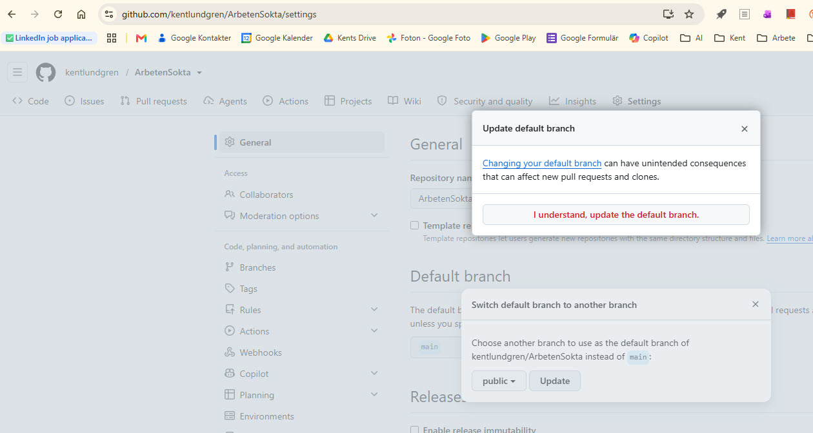
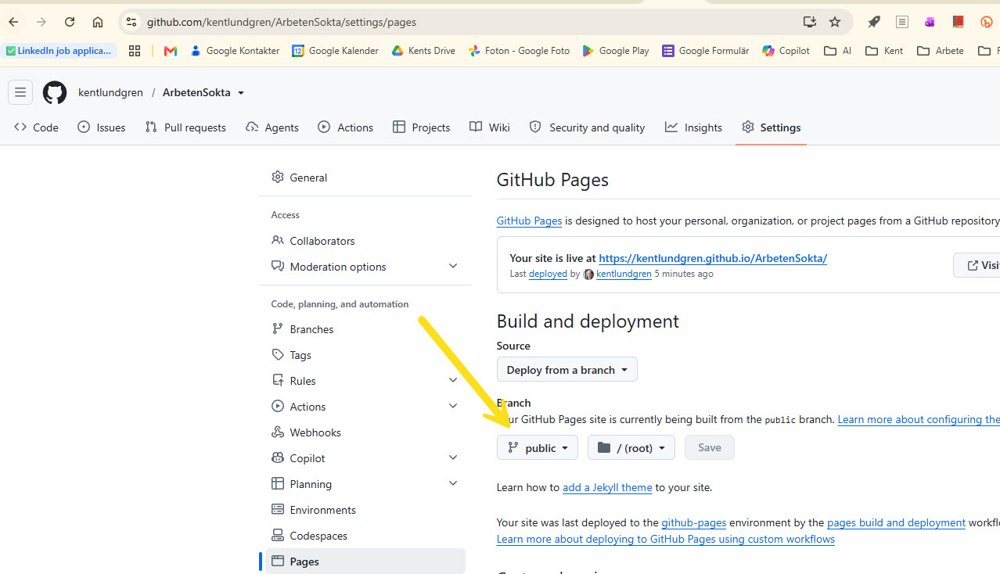
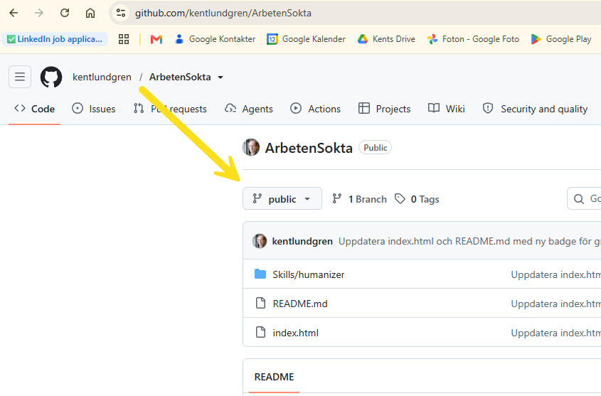
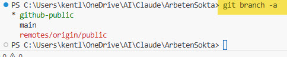

# Hur grenarna i ArbetenSokta hänger ihop

`skillprocess.md` beskriver *varför* och *hur* enstaka filer görs publika. Den
här filen beskriver bara en sak, mer i detalj: vilka grenar som faktiskt finns,
var de bor, och ett namnkrock-problem som uppstod och hur det löstes.

## Totalt två grenar, inte tre

Det finns exakt två grenar, **lokalt på datorn**. Ingen tredje gren har lagts
till, och ska inte läggas till:

| Gren (lokal) | Innehåll | Får pushas till GitHub? |
|---|---|---|
| `main` | Allt: CV, ansökningar, personlighetstester, alla skills. Privat. | Nej, aldrig (spärrat, se `ArbetenSokta/CLAUDE.md` avsnitt 1B). |
| `github-public` | Bara de filer som står i vitlistan (`ALLOWED_FILES` i `.git/hooks/pre-push`). Publikt. | Ja, det är den enda som får det. |

**På GitHub finns bara en enda gren**, den som `github-public` pushas till (den
heter `public` på fjärren – se namnkrocken nedan).

## Två barriärer mot att privat innehåll når GitHub (sedan 2026-08-30)

1. **Lokal pre-push-hook** (`.git/hooks/pre-push`) – tillåter bara push av grenen
   `github-public`, och bara filer på vitlistan. Skyddar den dator hooken ligger
   på. Följer inte med en `git clone`.
2. **GitHub branch-ruleset** ("Endast grenen public far finnas", id 21871865,
   `enforcement: active`, ingen bypass) – blockerar att någon gren utom `public`
   skapas eller uppdateras på fjärren, oavsett dator/klon och även för repo-ägaren.
   Kontrollera: `gh api repos/kentlundgren/ArbetenSokta/rulesets`. Fullständig
   beskrivning i repots `README.md`.

Barriär 2 lades till efter incidenten nedan, då barriär 1 visade sig otillräcklig.

## Namnkrocken som uppstod, och varför den var förvirrande

När `github-public` först pushades, döptes fjärrgrenen till "main":

```bash
git push -u origin github-public:main
```

Det gav ett repo på GitHub med en gren som heter "main", men innehållet kom
från `github-public`, inte från den lokala, privata `main`-grenen. Två helt
orelaterade saker som råkade dela namn. Det orsakade två konkreta problem:

1. **`git push origin main` gav ett förvirrande felmeddelande.** Git vägrade,
   med texten "non-fast-forward... kör Pull först". Det lät som om något gått
   fel, men det var egentligen bra: git kunde inte känna igen den lokala
   privata `main`-historiken som en fortsättning på fjärrens "main"-historik
   (som ju kom från `github-public`), och vägrade skriva över den. Att följa
   felmeddelandets råd (`git pull`) hade varit fel, det hade försökt slå ihop
   privat och publikt innehåll.
2. **Att bläddra till `github.com/kentlundgren/ArbetenSokta/blob/main/...`
   visade publikt innehåll**, vilket är helt korrekt (det är den enda grenen
   som finns där), men lätt att förväxla med den lokala `main`-grenen, som
   inte har något att göra med det som visas.

## Fixen: byt namn på fjärrgrenen, inte lägg till en ny

```bash
git push -u origin github-public:public   # skapar en NY fjärrgren, "public"
```

Detta skapar inte en tredje gren. Det är fortfarande samma två lokala grenar
som innan, bara att den publicerade motsvarigheten på GitHub nu heter "public"
istället för "main". `github-public` (lokalt) följer nu `origin/public`.

**Två manuella steg krävdes**, i GitHub:s webbgränssnitt, inte via git (git kan
byta namn på en gren, men "vilken gren är standard" och "vilken gren bygger
GitHub Pages från" är rena GitHub-inställningar, inte något `git push` rör):

**1. Settings → General → Default branch**, bytt från `main` till `public`:



**2. Settings → Pages**, källgrenen bytt från `main` till `public`:



Efter båda stegen: "Your site is currently being built from the public branch",
och sidan (`kentlundgren.github.io/ArbetenSokta`) fortsatte fungera utan avbrott,
eftersom den gamla `main`-grenen på fjärrservern fortfarande fanns kvar som
reserv medan bytet gjordes.

**Sista steget:** den gamla fjärrgrenen `main` är borttagen
(`git push origin --delete main`). Bara `public` finns kvar på GitHub.

> **Rättelse 2026-08-30:** Det här stämde inte. Vid en kontroll den 30 augusti
> 2026 visade det sig att en `main`-gren fanns kvar på GitHub – och att den nu
> innehöll **den privata `main`-historiken** (113 filer: CV, ansökningar, PRD,
> personlighetstester), inte det gamla vitlistade innehållet. Den hade pushats
> dit senast 2026-08-11. Grenen togs bort på riktigt samma dag, och läget
> verifierades mot GitHub den här gången. Hela incidenten finns beskriven i
> repots [`README.md`](../../README.md#när-den-privata-main-grenen-låg-publikt-aug-2026),
> med skärmdumpar. Lärdomen: en text som säger "borttagen" är inte ett bevis –
> `git ls-remote --heads origin` är beviset.

**Bekräftelse, sett direkt på `github.com/kentlundgren/ArbetenSokta`:**



Vad bilden faktiskt visar, tolkat rad för rad:

- **"1 Branch · 0 Tags"** – längst upp till höger om grenväljaren. Bara en
  gren finns i hela repot. Ingen `main` kvar att förväxla den med.
- **Grenväljaren** ("public", med en gren-ikon bredvid) visar namnet på den
  enda grenen, och att den redan är vald/aktiv, det är standardvyn nu, inte
  något man behöver leta upp.
- **Commit-raden** ("Uppdatera index.html och README.md med ny badge för
  g...") är den senaste committen som faktiskt hamnat på GitHub, författad av
  `kentlundgren`, inte av Claude, i linje med att Kent alltid committar och
  pushar själv.
- **Filträdet** under (`Skills/humanizer`, `README.md`, `index.html`) visar
  exakt den vitlistade mängden filer, ingenting utöver det.

Detta var tänkt som beviset att hela mekanismen, orphan-grenen, spärren,
namnbytet, höll ihop. Bilden togs vid ett tillfälle då bara `public` fanns –
men mellan då och 2026-08-30 pushades den privata `main` ändå till GitHub (se
rättelsen ovan). Mekanismen höll alltså *inte* fullt ut. Det som räknas är att
`git ls-remote --heads origin` visar bara `public` – och att man faktiskt kör
det kommandot då och då, inte litar på minnet eller en gammal skärmdump.

## Kommandon för att se grennamnen

Tre kommandon, olika räckvidd:

**`git branch`** – bara lokala grenar, stjärnan visar vilken man står på:
```
* github-public
  main
```

**`git branch -a`** – lokala grenar plus de fjärrgrenar datorn känner till (en
cachad bild, uppdateras vid fetch/push/pull, inte alltid helt färsk):



```
* github-public
  main
  remotes/origin/public
```

**`git ls-remote --heads origin`** – frågar GitHub direkt istället för att lita
på den lokala cachen, alltid aktuellt:
```
0a706a0...	refs/heads/public
```

## Vad grenarna faktiskt heter, som begrepp

"Global gren" är inte den vedertagna termen, även om den är begriplig. De rätta
orden:

| Term | Vad det är | Exempel här |
|---|---|---|
| **Lokal gren** (local branch) | Finns bara på din dator. | `main`, `github-public` |
| **Fjärrspårande gren** (remote-tracking branch) | En lokal *bokmärkning* av var en fjärrgren senast sågs, inte fjärrgrenen själv. Syns som `remotes/origin/...` i `git branch -a`. | `remotes/origin/public` |
| **Fjärrgren** (remote branch) | Den faktiska grenen som ligger på servern (GitHub). Det är den här man menar med "global". | `public`, på `github.com/kentlundgren/ArbetenSokta` |

## Är två lokala grenar och en fjärrgren ovanligt?

Nej, tvärtom, men det specifika sättet vi använt det på har en känd förlaga.

Att ha flera lokala grenar samtidigt (en för det man jobbar med, en eller flera
för annat) är helt vardagligt i git, det är hela poängen med grenar. Det som är
mer specifikt för just den här lösningen är **orphan-grenen som bara innehåller
ett urval filer, avsedd att publiceras separat från huvudarbetet**. Det mönstret
har en direkt motsvarighet i git-världen: `gh-pages`-grenen, som länge var
GitHub:s egna rekommenderade sätt att bygga en GitHub Pages-sida. Många projekt
har historiskt haft exakt den strukturen, en `main`-gren för koden och en
fristående `gh-pages`-gren (ofta en orphan-gren) bara för det som ska visas
publikt. Det vi byggt är samma grundidé, anpassad för att filtrera bort
personuppgifter snarare än att separera byggd dokumentation från källkod.

Det som är mindre vanligt, och ett medvetet val här: att den lokala grenen
(`github-public`) och fjärrgrenen (`public`) heter olika saker. Vanligtvis
namnger man dem lika för enkelhetens skull. Här blev det olika namn av en
historisk anledning (fjärrgrenen hette ursprungligen "main", vilket krockade
med den lokala privata `main`-grenen, se ovan), inte som ett generellt råd att
följa i andra projekt.

## En synlig etikett på sidan, med en viktig begränsning

Live-sidan (`index.html`) har nu en liten badge uppe till vänster, "⑂ public",
som en påminnelse om vilken gren innehållet kommer från. Den är **statisk
text**, inte något som läser av git. En vanlig HTML-sida i en webbläsare har
ingen koppling till git överhuvudtaget, den vet inte var filen kom ifrån. Om
grenen någon gång byter namn igen måste den texten uppdateras för hand, precis
som vitlistan i hook-filerna. Ingen automatik håller den i synk.

## Sammanfattning, som en enkel regel

"Main" betyder alltid den lokala, privata grenen. Om något publikt visas under
namnet "main" på GitHub är det ett namn som råkar krocka, inte samma innehåll.
Efter namnbytet ovan finns den förväxlingen inte längre: publikt innehåll på
GitHub heter numera "public", aldrig "main".
