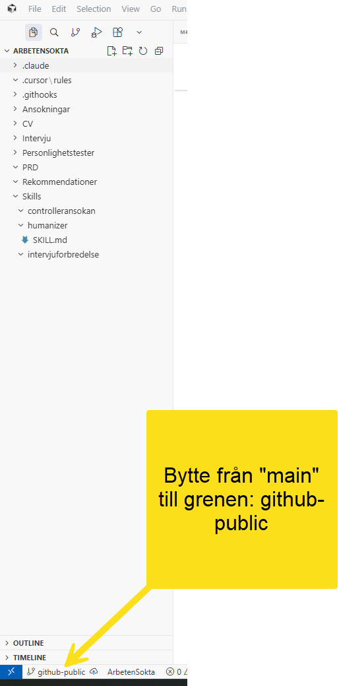

# Hur en enda fil blir publik ur ett repo fullt av personliga filer

Det här dokumentet beskriver hur `ArbetenSokta`, ett repo med jobbansökningar, CV och
personlighetstester, kan ha exakt en publik fil på GitHub, `Skills/humanizer/SKILL.md`,
utan att något av det andra innehållet riskerar att följa med. Inte som en regel man
måste komma ihåg, utan som en teknisk spärr som stoppar det även om man skulle glömma.

## Problemet

De flesta filerna i `ArbetenSokta` (CV, ansökningar, personlighetstester,
intervjuförberedelser) innehåller personuppgifter och ska aldrig bli publika. Men en av
skillsen i projektet, `humanizer` (regler för att ta bort AI-skrivmönster), innehåller
ingen personlig information alls och är generellt användbar. Frågan blev: hur delar man
den ena filen publikt utan att riskera resten?

Ett separat repo för bara den filen är ett sätt att lösa det, men det är inte det som
används här. Lösningen nedan håller allt i **samma** repo, med samma historik för
"main"-innehållet som redan fanns, och löser separationen med grenar och en spärr.

## Lösningen: en gren utan delad historik + en teknisk spärr

**1. En orphan-gren.** `github-public` skapades med `git checkout --orphan
github-public`. En orphan-gren delar ingen historik med `main` alls, den vet inte att
CV:n eller ansökningarna existerar. Den innehåller bara det som uttryckligen läggs till
på den, ingenting ärvs.

```bash
git checkout --orphan github-public
git reset                              # rensar det som main lämnade i indexet
git add Skills/humanizer/SKILL.md      # bara den tillåtna filen
git commit -m "Publicera humanizer-skillet"
git checkout main                      # tillbaka till vardagsarbetet
```

### Varför byta gren över huvud taget?



Git checkar bara ut det som en gren faktiskt känner till. `main` känner till allt
(CV, ansökningar, personlighetstester, humanizer-skillet). `github-public` känner
bara till de tre filerna på vitlistan. Att byta gren i Cursor (skärmdumpen ovan,
nere till vänster i fönstret) byter alltså vilka filer som syns i Utforskaren och
vilken historik `git commit`/`git push` arbetar mot just då.

**Varför man behöver byta till `github-public`:** Det är den enda grenen som får
pushas (se spärren nedan). Vill man publicera eller uppdatera något av det som är
tänkt att bli publikt, måste man stå på just den grenen när man committar och
pushar, annars finns det ingen giltig plats att skicka ändringen till.

**När man ska byta tillbaka till `main`:** Direkt efter att publiceringen är klar,
det vill säga så fort man har körts `git push` (eller bestämt sig för att inte
pusha just nu). `github-public` är inget att jobba vidare i. Allt vardagsarbete,
CV, ansökningar, redigering av `controlleransokan`- och
`intervjuforbredelse`-skillsen, och även det löpande arbetet med att skriva
`SKILL.md` för humanizer, sker på `main`. `github-public` är bara en tillfällig
"publiceringsstation": byt till den, uppdatera/committa/pusha, byt direkt tillbaka.

**Bekräftat: ja, all push av `main` till GitHub är spärrad.** Inte bara
avskräckt eller dokumenterad som en regel, tekniskt blockerad av
`.git/hooks/pre-push` oavsett vem som försöker och vilket kommando som skrivs.
Se testresultatet i punkt 3 nedan.

**2. En pre-push-hook som teknisk spärr.** En git-hook (`.git/hooks/pre-push`) körs
automatiskt varje gång `git push` anropas, innan något skickas iväg. Den kontrollerar:

- Är grenen som pushas exakt `github-public`? Om inte: avbryt.
- Innehåller den grenen bara filer från en vitlista (`ALLOWED_FILES` i hook-skriptet)?
  Om inte: avbryt.

Skillnaden mot att bara skriva en regel i CLAUDE.md: en regel kan glömmas eller
missförstås. En hook som avbryter kommandot fungerar likadant oavsett vem (Kent eller
Claude) som råkar skriva `git push origin main`.

**Fallgrop, upptäckt under testet:** hook-skriptet låg först i en spårad mapp
(`.githooks/`, aktiverad via `git config core.hooksPath .githooks`) för att vara
läsbar och versionshanterad. Men den mappen finns bara på grenen `main`, inte på
`github-public`, orphan-grenen känner inte till den. Resultatet: spärren fungerade
när jag testade från `main`, men var helt frånvarande, kördes aldrig, exakt när man
faktiskt står på `github-public` och pushar på riktigt. Fixen: den aktiva hooken
måste ligga i `.git/hooks/pre-push`, som inte är en del av någon gren utan alltid
finns oavsett vad som är utcheckat. En läsbar kopia kan fortfarande sparas spårad
(t.ex. i `.githooks/`) som referens, men den aktiva versionen måste ligga utanför
grenarnas räckvidd. Testat på nytt, från `github-public`, efter fixen: spärren
fungerar nu i den situation den faktiskt behövs.

**3. Verifierat mot en låtsas-server innan något riktigt GitHub-repo fanns.** Innan
`kentlundgren/ArbetenSokta` skapades på GitHub testades spärren mot ett tillfälligt,
lokalt bare-repo:

```
Försök: git push <låtsas-remote> main            → SPÄRR: push av 'refs/heads/main' är blockerad.
Försök: git push <låtsas-remote> github-public   → lyckades, exakt de tillåtna filerna hamnade där.
```

## Vad som faktiskt är publikt

Just nu, uteslutande innehållet i grenen `github-public`:

- `Skills/humanizer/SKILL.md`
- `Skills/humanizer/skillprocess.md` (den här filen)
- `Skills/humanizer/Cursor_bytte_from_main_till_github-public.jpg` (skärmdump av grenbytet)

Allt annat i `ArbetenSokta`, inklusive `controlleransokan`- och
`intervjuforbredelse`-skillsen (som innehåller kontaktuppgifter och en
personlighetsprofil), stannar på `main` och kan tekniskt inte pushas till samma remote.

## Att uppdatera den publika versionen senare

Redigera filen på `main` som vanligt, committa där. Publicera sedan:

```bash
git checkout github-public
git checkout main -- Skills/humanizer/SKILL.md   # hämtar senaste versionen från main
git add Skills/humanizer/SKILL.md
git commit -m "Uppdatera humanizer-skillet"
git push origin github-public:main
git checkout main
```

## Källa till skill-strukturen själv

Anthropic (u.å.) *Skill Development for Claude Code Plugins*. [SKILL.md]
claude-plugins-official (GitHub). Tillgänglig:
https://github.com/anthropics/claude-plugins-official/blob/main/plugins/plugin-dev/skills/skill-development/SKILL.md
[Hämtad: 2026-07-28].
